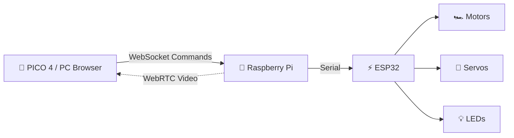

# CN360 Robot Rescue VR

[](https://www.tttracker.space)
[](https://www.tttracker.space)
[]()
[]()
[]()

> **A compact confined-space rescue robot controlled from a PICO 4 headset via WebXR.**  
> Head movement steers the pan/tilt camera, controller joystick drives the robot, buttons control LED lighting. Video streams back over WebRTC.

---

## 🎯 Key Features

| Feature | Description |
|---------|-------------|
| 🎮 **Immersive VR Control** | WebXR head tracking + controller input on PICO 4 |
| 📹 **Real-time Video** | WebRTC streaming from robot camera to headset |
| 🤖 **Pan/Tilt Camera** | Head movement maps to servo-controlled camera gimbal |
| 💡 **LED Lighting** | Controller buttons toggle robot LEDs for dark environments |
| 🕸️ **Web-based** | No app install — runs in PICO Browser over HTTPS |
| ⚡ **Low Latency** | WebSocket commands + WebRTC video on local network |

---

## 🏗️ System Architecture



**Data Flow:**
```
PICO 4 / PC browser ──WebSocket (commands)──▶ Raspberry Pi ──Serial──▶ ESP32 ──▶ motors / servos / LED
        ▲                                         │
        └──────────────WebRTC (video)─────────────┘
```

---

## 📁 Project Structure

```
CN360/
├── WebApp/              # 🌐 Operator web app (WebXR, Three.js, HUD)
├── Robot/
│   ├── RaspberryPi/     # 🍓 HTTP + WebSocket server, command bridge
│   ├── ESP32/           # ⚡ MicroPython/Arduino motor & servo control
│   └── ROS2/            # 🤖 ROS 2 bridge (future phase)
├── TestTools/           # 🧪 Communication test utilities
├── Docs/                # 📚 Documentation & hardware notes
└── UnityProjects/       # 📦 Legacy Unity prototype (reference only)
```

| Directory | Status | Description |
|-----------|--------|-------------|
| `WebApp/` | 🟡 Planned | WebXR head tracking, controller input, HUD, video view |
| `Robot/RaspberryPi/` | 🟢 In Progress | aiohttp + WebSocket server, serves WebApp, forwards to ESP32 |
| `Robot/ESP32/` | 🟢 In Progress | Drive motors, pan/tilt servos, LED control |
| `Robot/ROS2/` | ⚪ Later | ROS 2 integration bridge |
| `TestTools/` | 🟢 Active | Serial/WebSocket test utilities |
| `Docs/` | 🟢 Active | Hardware specs, wiring diagrams, API docs |
| `UnityProjects/` | 🔴 Archived | Legacy prototype (kept until WebApp reaches M2) |

---

## 🚀 Getting Started

### Prerequisites
- **Raspberry Pi** — Python 3.9+ (`aiohttp`, `pyserial`, `aiortc`)
- **ESP32** — MicroPython or Arduino IDE
- **PICO 4** — PICO Browser (WebXR requires HTTPS or `localhost`)
- **Network** — Pi and headset on same LAN

### Quick Start (Mock Mode - No Hardware)
```bash
# On PC / Pi
cd Robot/RaspberryPi
python code.py --mock

# Open in browser
# Desktop: http://localhost:8080
# PICO 4:  https://<pi-ip>:8080 (requires TLS cert for WebXR)
```

### Hardware Mode
```bash
# 1. Flash ESP32 firmware
cd Robot/ESP32
# Upload via Arduino IDE or esptool

# 2. Run Pi server
cd ../RaspberryPi
python code.py

# 3. Connect from PICO 4 browser to https://<pi-ip>:8443
```

> ⚠️ **WebXR requires HTTPS.** Generate self-signed certs for LAN testing:
> ```bash
> openssl req -x509 -newkey rsa:2048 -nodes -keyout key.pem -out cert.pem -days 365
> ```

---

## 🗺️ Roadmap

| Milestone | Target | Status |
|-----------|--------|--------|
| **M1** — Pi ↔ ESP32 serial bridge + mock WebApp | Q1 2025 | 🟢 Done |
| **M2** — WebRTC video + WebXR head tracking on PICO 4 | Q2 2025 | 🟡 In Progress |
| **M3** — Full teleop: drive + pan/tilt + LED + HUD | Q3 2025 | ⚪ Planned |
| **M4** — ROS 2 bridge + autonomous navigation aids | Q4 2025 | ⚪ Planned |
| **M5** — Field testing & hardening | 2026 | ⚪ Planned |

See [plan.md](plan.md) for detailed task breakdown.

---

## 🛠️ Tech Stack

| Layer | Technology |
|-------|------------|
| **VR Interface** | WebXR API, Three.js, TypeScript |
| **Signaling** | WebSocket (aiohttp) |
| **Video Streaming** | WebRTC (aiortc) |
| **Edge Compute** | Raspberry Pi 4/5, Python 3.11+ |
| **MCU** | ESP32, MicroPython / Arduino |
| **Actuators** | DC motors (drive), Servos (pan/tilt), WS2812 LEDs |
| **Comms** | Serial (UART) Pi ↔ ESP32, WiFi AP/STA |

---

## 📖 Documentation

- [Project Plan](plan.md) — Milestones, tasks, timeline
- [Repository Structure](PROJECT_STRUCTURE.md) — Detailed folder layout
- [Hardware Notes](Docs/hardware.md) — Wiring, pinouts, BOM
- [API Reference](Docs/api.md) — WebSocket messages, REST endpoints

---

## 🤝 Contributing

1. Fork the repo
2. Create a feature branch: `git checkout -b feat/amazing-feature`
3. Commit changes: `git commit -m 'Add amazing feature'`
4. Push: `git push origin feat/amazing-feature`
5. Open a Pull Request

---

## 📄 License

No license specified yet. All rights reserved.

---

## 🔗 Links

- **Project Page:** [tttracker.space](https://www.tttracker.space)
- **Issues:** [GitHub Issues](https://github.com/saifadecha07/CN360/issues)
- **Discussions:** [GitHub Discussions](https://github.com/saifadecha07/CN360/discussions)

---

<p align="center">
  Made with ❤️ for rescue robotics
</p>